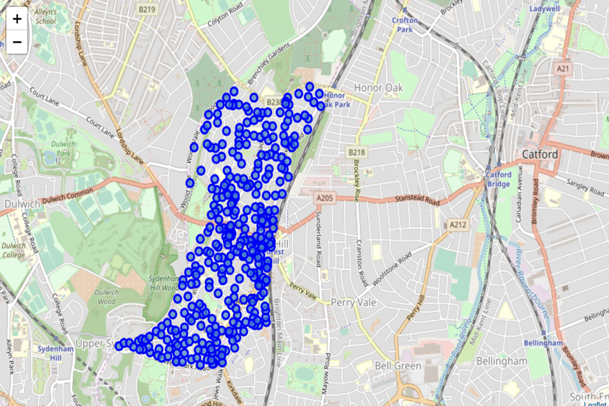
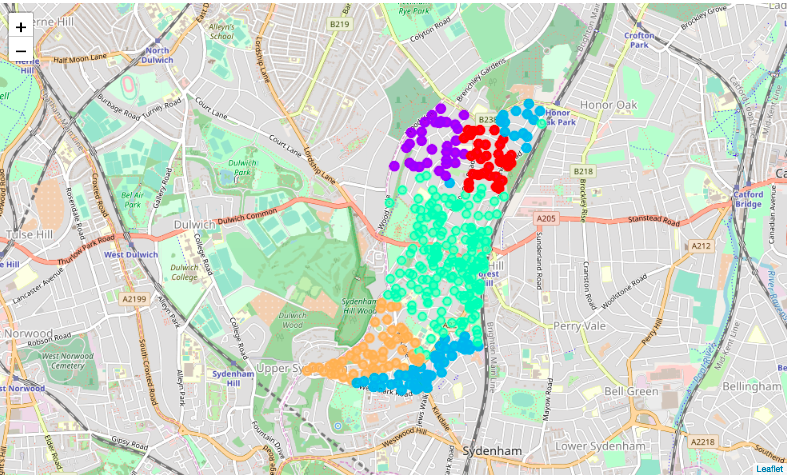

## Simplifying your house search in London

### Introduction/ Business Problem

Its very challenging to find a house in London, UK. There are many websites out there that try to help you out with searching your house like Zoopla, Rightmove. But even then narrowing down area to look for is a manual task that these websites do not automate/provide. Narrowing down area can be very tedious and time consuming process.

This project attempts to help you with identifying or narrowing down the search for the house according to your preferences about the neighborhood. 
For example, one might want to look at all areas which has proximity to pubs, cafes, public transport etc. This project attempts cluster areas based on your provided preferences/categories. We then print those clusters on the map to distinguish between areas. That should make it easy to choose a certain areas to look for and narrow down your search.

**Stakeholders/Target Audience**: People who are looking to find house in London, especially the people who are starting their house search and has certain preferences.

Note: This project attempts to solve the first step of your house search only, not everything. Websites mentioned above are still relevant and should be seen as complimentary to this project.


### Data

I used two datasets for the above problem:

a. London Lewisham council postcodes data downloaded from [Doogle](https://www.doogal.co.uk/AdministrativeAreasCSV.ashx?district=E09000023). This dataset contains all postcodes present in the Lewisham council in London. We narrow down to Lewisham council (and mainly focus on forest hill ward) to minimize the calls to Four square API.

Lewisham council postcodes data has many columns out of which only Postcode, Longitude, Latitude and Ward of the postcode are of our interest. Snapshot of the data is shown below: 

```
Postcode	In Use?	Latitude	Longitude	Easting	Northing	Grid Ref	Ward	Parish	Introduced	Terminated	Altitude	Country	Last Updated	Quality
BR1 4BY	Yes	51.417289	-0.001741	539050	170591	TQ390705	Downham	Lewisham, unparished area	1980-01-01		35	England	2018-11-15	Within the building of the matched address closest to the postcode mean
  ```

b. The second dataset I used is Foursquare venues data with categories, this will be used in collaboration with the above dataset.

**Assumptions**: Data is downloaded from Doogle and it comprises of postcodes in Lewisham council In London, UK. Assuming that this data is limited and doesn't represent actual availability of the house. But that should be easy as we could just focus on the area here. I am going to focus on only Forest Hill part of the Lewisham as FourSquare api has aggressive rate limit for explore api of 500 calls/day

### Methodology

This section is divided into three main parts, data wrangling/Cleansing, Exploratory analysis and machine learning method used to solve the problem. 

  * **Data Wrangling/ Cleansing**: Data obtained from [Doogle](https://www.doogal.co.uk/AdministrativeAreasCSV.ashx?district=E09000023) for Lewisham coucil has many columns but I concentrated on few columns only (Postcode, Latitude, Longitude and Ward). Also to obtain uniqueness on the different location, I explored the postcodes and learned that every postcode in Lewisham is divided into two major parts, District and Sector. I created a new column which contain Sectors and added the new column to the cleansed data. Also, I filtered the data for Forest Hill ward to minimize the calls to Four square API.

  * **Exploratory Analysis**: Lewisham data has 18 unique wards and I filtered on a single ward as a point of interest namely Forest Hill. As explained in the cleansing step that postcode is comprised of two components, district and sector, I obtained 2 districts (SE23 and SE26) and 369 unique sectors from Forest Hill. I also plotted all the sectors on the map and then I created five different clusters based on the venue categories provided by Foursquare API data. I noticed that one of the clusters is giving imprecise points as shown in second map. 
  
  
  
  
  
  Since our objective is to ease the search for  people who have preferences in terms of nearby venues, I tried to explore all the sectors under Forest Hill ward using Four square API and obtained multiple venues names, their geographical coordinates and category for each sector within 500m radius and put a limit on the number of venues as 100 for each sector.
  
  From four square API, I obtained 46 different venue categories like Café, Pubs, Public transport, Park, Nature Reserve, Vintage stores etc.

  * **Machine Learning**: I decide to use K means Clustering for the problem because after the exploratory analysis it was obvious that we can categorise postcodes into different homogenous clusters based on the venue categories. 

Further on, we need to create our dataset in a format where rows will represent the sectors and all columns will be venue categories and we will calculate the score for every category in each sector as per their presence or absence in the sector. We sort the catgories for each sector in order of their occurence, for example if a sector has more cafes and pubs, the sector will get higher score for the cafes and pubs and less for other categories. 

The previous step will be sufficient to execute data mining technique I chose to accomplish this task(K mean clustering). K means clustering will segment the data into groups where groups are similar among themselves but different from other groups in terms of occurence of venue categories. For our dataset, K mean clustering will append another column to the dataset which will depict the cluster number, similar sectors will be grouped together. 


### Result

I obtained 5 clusters from K means clustering executed in the previous step which are explained below:-

* Cluster 0. Contains houses with proximity to Indian Restaurants, Bus Stops, Train stations etc.
* Cluster 1. For youngsters - The cluster highlights all houses in the proximity to cafes, pubs and nightlife etc.
* Cluster 2. It contains houses with proximity to Vintage stores, nature reserves etc.
* Cluster 3. It contains houses with proximity to Japenese restaurant, Grocery Stores, Mobile shopts etc.
* Cluster 4. Is suitable for those who like greenary, nearby forest, parks etc.

### Conclusion

The above clusters segment the data into 5 homogeneous groups which exhibit similarities among themselves in terms of venue categories ane being heterogenous from the other groups. For example, If an individual is interested in staying near to places with proximity to pubs and cafes, Cluster1 is a great choice or if greenry, forest and parks are of interest to someone, sectors under cluster 5 are the most suitable. 

This will not only reduce an indiviual effort to go through all locations but also narrow down their search by giving them the liberty and choice to stay in their desired area. 


